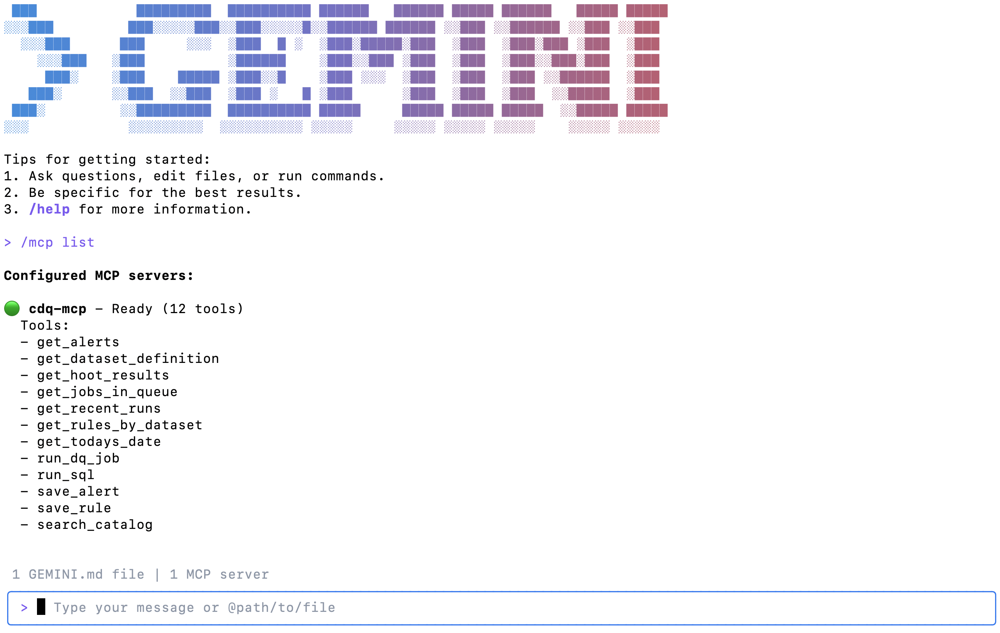
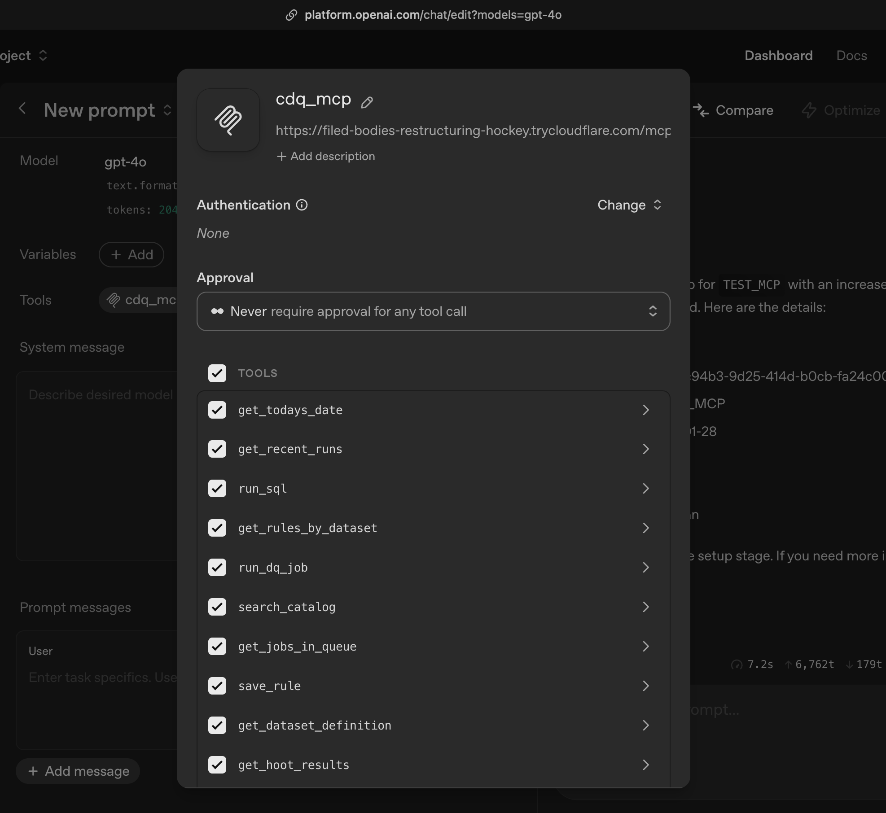
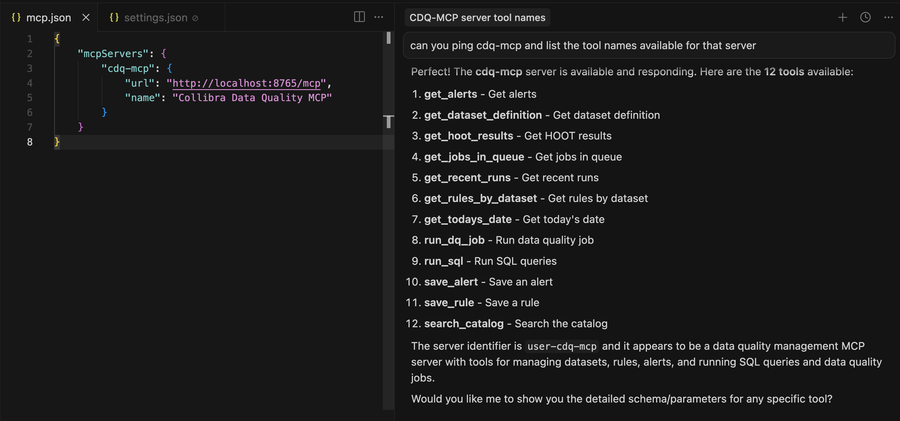
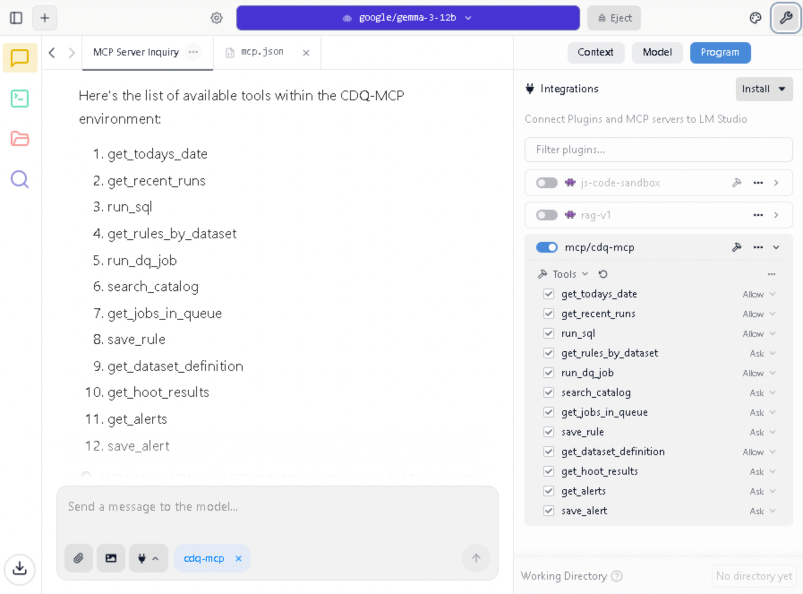
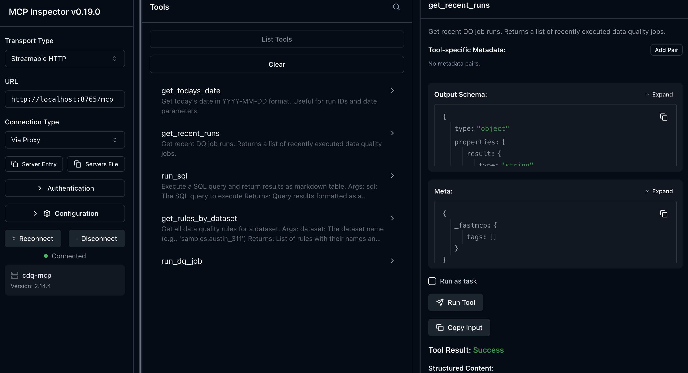

# cdq-mcp

Lightweight MCP server with HTTP transport using FastMCP. Run SQL, add rules, and creating DQ jobs (100% REST API). 


## Tools 
| Tool                   | Inputs                                              | Description                                 |
|------------------------|----------------------------------------------------|---------------------------------------------|
| run_dq_job             | dataset (str), run_id (str), sql (str)             | Register a dataset and run a DQ job         |
| get_recent_runs        | none                                               | Get recent DQ job runs                      |
| get_jobs_in_queue      | limit (int, default 10), status (str)              | Get jobs currently in queue                 |
| get_hoot_results       | dataset (str), run_id (str)                        | Get DQ results for a specific run           |
| run_sql                | sql (str)                                          | Execute a SQL query                         |
| search_catalog         | search_string (str), limit (int, default 50)       | Search datasets in catalog                  |
| get_rules_by_dataset   | dataset (str)                                      | Get DQ rules for a dataset                  |
| save_rule              | dataset, rule_name, rule_sql, points (1), perc (1) | Create a new DQ rule                        |
| get_dataset_definition | dataset (str)                                      | Get dataset configuration                   |
| get_alerts             | dataset (str)                                      | Get alerts for a dataset                    |
| save_alert             | dataset, alert_name, condition, email, message     | Create an alert                             |
| get_todays_date        | none                                               | Get today's date (for run IDs)              |

## Example Usage 

#### CLI (Gemini, Claude)


#### OpenAI (via tunnel)


#### IDE (Cursor, Windsurf)


#### Private Models



## Setup

Create a `.env` file with your Collibra DQ credentials:

```env
DQ_URL=https://your-collibra-dq-instance.com
DQ_USERNAME=your_username
DQ_PASSWORD=your_password
DQ_ISS=your_tenant
DQ_CXN=BIGQUERY
```

Create virtual environment and install dependencies:

```bash
python3 -m venv venv
source venv/bin/activate
pip install -r requirements.txt
```

## Virtual Environment

```bash
# Activate
source venv/bin/activate

# Deactivate
deactivate
```

## Server

```bash
# Start (foreground)
./start.sh

# Or manually
source venv/bin/activate
python server.py

# Start (background)
./start.sh &

# Stop
pkill -f "python server.py"
```

Server runs at `http://0.0.0.0:8765/mcp`

## Docker

Build the image:

```bash
docker build -t cdq-mcp .
```

Run with env file:

```bash
docker run --rm -p 8765:8765 --env-file .env cdq-mcp
```

Or pass env vars directly:

```bash
docker run --rm -p 8765:8765 \
  -e DQ_URL=https://your-server \
  -e DQ_USERNAME=user \
  -e DQ_PASSWORD=pass \
  -e DQ_ISS=your-iss \
  -e DQ_CXN=BIGQUERY \
  cdq-mcp
```

Run in background:

```bash
docker run -d --name cdq-mcp -p 8765:8765 --env-file .env cdq-mcp

# Stop
docker stop cdq-mcp && docker rm cdq-mcp
```

## Pre-Built Container (2026-01-28)
```bash
docker pull brianmearns162/cdq-mcp:latest

docker run --rm -p 8765:8765 --env-file .env brianmearns162/cdq-mcp:latest
```


## Testing with Inspector (Suggested)

Use the MCP inspector to interact with the tools and inspect the inputs and outputs.

```bash
npx @modelcontextprotocol/inspector
```




## Testing with curl

MCP uses a session-based protocol. Follow these steps to test the server.

### Step 1: Initialize session and get session ID

```bash
curl -i -X POST http://localhost:8765/mcp \
  -H "Content-Type: application/json" \
  -H "Accept: application/json, text/event-stream" \
  -d '{"jsonrpc":"2.0","id":1,"method":"initialize","params":{"protocolVersion":"2024-11-05","capabilities":{},"clientInfo":{"name":"curl-test","version":"1.0"}}}'
```

Look for `mcp-session-id` in the response headers:

```
mcp-session-id: abc123def456...
```

### Step 2: List available tools

Use the session ID from step 1:

```bash
curl -X POST http://localhost:8765/mcp \
  -H "Content-Type: application/json" \
  -H "Accept: application/json, text/event-stream" \
  -H "mcp-session-id: YOUR_SESSION_ID" \
  -d '{"jsonrpc":"2.0","id":2,"method":"tools/list"}'
```

### Step 3: Call a tool

```bash
curl -X POST http://localhost:8765/mcp \
  -H "Content-Type: application/json" \
  -H "Accept: application/json, text/event-stream" \
  -H "mcp-session-id: YOUR_SESSION_ID" \
  -d '{"jsonrpc":"2.0","id":3,"method":"tools/call","params":{"name":"get_recent_runs","arguments":{}}}'
```

### Quick health check (no session needed)

Verify server responds to MCP protocol:

```bash
curl -s http://localhost:8765/mcp \
  -H "Accept: text/event-stream"
# Should return: {"jsonrpc":"2.0",...,"message":"Bad Request: Missing session ID"}
```

## MCP Client Configuration

### Cursor

Add to `~/.cursor/mcp.json`:

```json
{
  "mcpServers": {
    "cdq-mcp": {
      "url": "http://localhost:8765/mcp",
      "name": "Collibra Data Quality MCP"
    }
  }
}
```

### Claude CLI

Add to `~/.claude/settings.json`:

```json
{
  "mcpServers": {
    "cdq-mcp": {
      "url": "http://localhost:8765/mcp"
    }
  }
}
```

### Claude Desktop

Add to `~/Library/Application Support/Claude/claude_desktop_config.json` (macOS) or `%APPDATA%\Claude\claude_desktop_config.json` (Windows):

```json
{
  "mcpServers": {
    "cdq-mcp": {
      "url": "http://localhost:8765/mcp"
    }
  }
}
```

## Adding Tools

```python
@mcp.tool()
def my_tool(param: str) -> str:
    """Tool description"""
    return f"Result: {param}"
```

## SQL Interactions

SQL interactions use the native SQL dialect of the configured connection. This is optimal when used with a **pushdown** connection type, where queries are executed directly on the data source rather than pulling data into the DQ engine.

## Known Limitations

- Adaptations may be needed and code may vary depending on your use case and instance configuration
- To be used for portable/personal MCP interactions
- This is an unofficial reference server
- Currently supports 1 Connection at time(cxn)
- Rule types are limited to Freeform (SQLF)
- Rules are saved as 'Absolute' scoring (not percentage/threshold)
- SQL Queries will run same limit as Web config
- Intended as a reference framework for *Classic* CDQ

